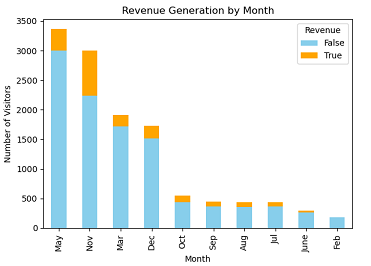
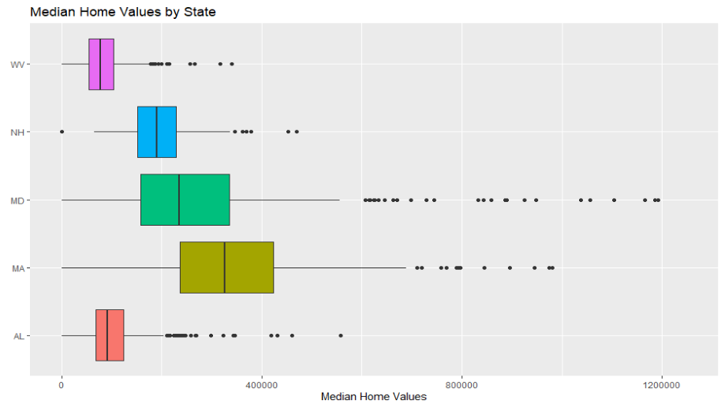
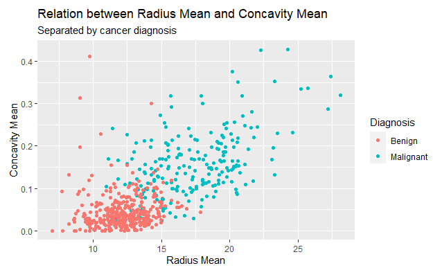

# Jonathan Monteiro's Data Science Portfolio

# [Project #1: Predicting Revenue Generation with Customers' Web Browsing Data]()
* Created a prediction model designed to classify whether or not a customer will generate revenue for the company based on their browsing tendencies on the company website
* The data set included 15+ variables, including which sections of the website they visited, how long they visited those sections for, if they were a returning visitor and more
* Within Python, several Supervised Learning machine learning algorithms were utilized including Logistic Regression, Decision Trees, Random Forest, and Gradient Boosting
* Unsupervised Learning method, Clustering, was also employed in order to gain further insight from the customer data
* Performance analysis determined that the Gradient Boosting model was the most effective method to use, with 90 percent accuracy 

# [Project #2 Estimating Median Home Values Based on Societal Variables](https://github.com/jgmonteirohub/Predicting-Median-Home-Values-With-Societal-Variables)
* Created a machine learning model that could estimate a city's median home value based on factors within the city, such as average household income, school test scores and more. 
* Utilized R programming language to webscrape information from over 1800 cities on the website "www.AreaVibes.com"
* Multiple linear regression was determined to be the most effective machine learning technique to solve this challenge 
* Analyzed 10+ predictor variables to order to ascertain which were the most important in predicting the city's median home values

# [Project #3: Classifying Breast Masses as Benign or Malignant Based on Physical Characteristics of Cell Nuclei](https://github.com/jgmonteirohub/Diagnosing-Breast-Cancer-with-ML-)
* Created a machine learning model that can predict whether or not a breast mass is cancerous based on physical characteristics of cell nuclei from the breast mass
* The data was collected by the University of Wisconsin and consists of 30+ physical attriputes of cell nuclei based on images taken of the breast mass with a fine needle aspirate
* Classification machine learning algorithms were implemented in R programming, such as Logistic Regression, Bagging, Boosting, and more.
* After observing their performance, the Boosting model was determined to be the most effective model with an accuracy of 95.6

